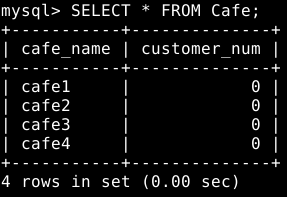
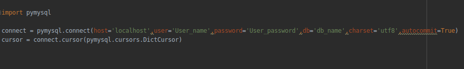
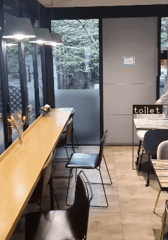
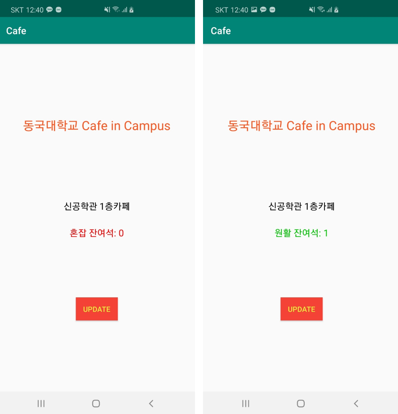

#   Android app Using YOLO Real-time customer number and congestion in Your Cafe 

 실시간으로 카페에 존재하는 고객 수와 이용가능한 좌석 수를 보여줍니다.
 
 ## 베이스 모델 (Based on Models)
 - **YOLO(Python)** : 실시간 이용 고객 수 탐지
 - **flask** : 웹 서버 연결
 -  **mysql** : DB

## 사용 방법 (How to use)
 -  Mysql DB 생성 :
	 -  mysql> CREATE TABLE Cafe (cafe_name VARCHAR(100), 	           customer_num INT);
   	 -  mysql> INSERT INTO Cafe VALUES( '*Your_Cafe_name*', 0)
	 
	 - ex)  
	

- cam_demo.py 실행 :
     - 17번째 줄 
      connect = pymysql.connect(host='localhost', user='*User_name*', password='*User_password*', db='*db_name*', charset='utf8', autocommit=True)
     생성한 DB 계정과 Password, DB 명을 넣어서 연결해주시면 됩니다.
	 
	
	 
	 - Query문 수정 164번째 줄 쿼리로 DB내에 존재하는 조회할 카페 조정 
	  sql = "UPDATE Cafe set customer_num={} where cafe_name={} ;".format(person, '*Your_Cafe_name*')
	  
- Web server 연결 
    - run.py 실행
    - app.run(host="0.0.0.0", port="*Your_port_num*")

## 실행 예시

- cam_demo.py

  
- application in the phone

	

## References

*eriklindernoren* 

original code
https://github.com/eriklindernoren/PyTorch-YOLOv3

## Created by
- Jungseob, Lee. (이정섭) - omanma1928@naver.com - b.s. Dongguk Universitiy in Seoul, Data Mining Lab.
- Jinsoo, Lee. (이진수) - jinsoo8409@naver.com - b.s. Dongguk Universitiy in Seoul, Data Mining Lab.
- Juwon, Seo. (서주원)  - wndnjs3334@gmail.com - b.s. Dongguk Universitiy in Seoul, Data Mining Lab.